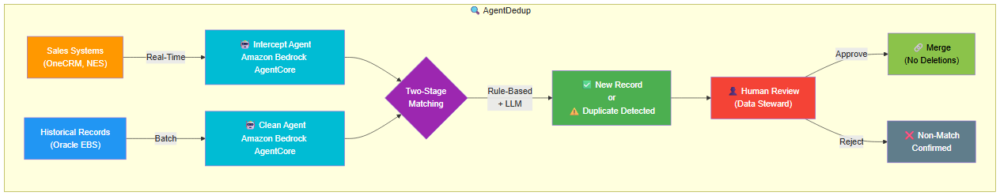

# Solving Enterprise Customer Deduplication with AWS Serverless and Agentic AI in Education and Publishing

## The Hidden Cost of Duplicate Records

Global education publishers and assessment providers manage customer master data across dozens of disconnected systems. A single institution — a school, university, or corporate training partner — might exist as three separate records: one created by the sales team in a CRM, another entered manually during order processing, and a third generated by a self-service registration portal. Multiply this across thousands of accounts operating in multiple countries, and the scale of the problem becomes clear.

For organizations operating Oracle E-Business Suite (EBS) as their system of record, the Trading Community Architecture (TCA) module — specifically HZ_PARTIES and HZ_PARTY_SITES — accumulates these duplicates over years. One education publisher we worked with discovered that a single school account had 24 active site records, all representing the same physical address with minor formatting variations: "ELTHAM HILL" versus "ELTHAM HILL SCHOOL, Eltham Hill" versus "Eltham Hill, LONDON, GREENWICH, SE9 5EE."

The downstream impact is significant. Duplicate records lead to split order histories, fragmented billing, inaccurate royalty calculations, and compliance gaps in data governance reporting. For assessment providers handling student data across jurisdictions, duplicates create GDPR and FERPA exposure that carries real regulatory risk.

## Why Traditional Deduplication Falls Short

Oracle EBS provides a native deduplication capability through the TCA Duplicates Identification Program. This batch job runs on a schedule — typically nightly or weekly — applying deterministic match rules using algorithms like Jaro-Winkler similarity and Soundex phonetic encoding. These rules work well for exact or near-exact matches: same email, same phone number, same tax registration ID.

But they fail in three critical scenarios that education and publishing organizations encounter daily:

**Semantic name variations.** "Meridian Learning Corp." and "Meridian Lrng" are clearly the same entity to a human, but a Jaro-Winkler score alone may not cross the confidence threshold. "Chris James" and "Chrish James" — a common data entry typo — requires contextual reasoning beyond string distance.

**Address formatting inconsistencies.** International addresses present particular challenges. "C. DE LA RESINA, 35, NAVE 7, VILLAVERDE, 28021 MADRID, SPAIN" entered three times with different punctuation and casing creates three active site records that deterministic rules struggle to consolidate.

**Cross-system timing.** By the time a nightly batch job identifies a duplicate, the record has already entered the system of record. Orders, invoices, and subscriptions are already linked to it. The cost of remediation grows exponentially with time.

| Capability | Traditional (Oracle TCA Batch) | Agentic AI Approach |
|---|---|---|
| Detection timing | Batch (nightly/weekly) | Real-time interception + batch cleanup |
| Matching intelligence | Fixed rules (JW, Soundex, exact match) | Rules + LLM semantic reasoning |
| Adaptability | DBA must modify match rules | LLM dynamically reasons about data quality |
| Address handling | Exact/near-exact only | Normalized comparison with abbreviation expansion |
| Decision authority | Auto-merge or manual queue | Human-in-the-loop for all merges |
| Cross-system scope | Within Oracle EBS only | Intercepts at the gateway before records enter EBS |
| International support | Limited format awareness | UK postcodes, Spanish addresses, abbreviation handling |
| Audit trail | Oracle internal logs | S3-based audit logs with full decision rationale |

## An Agentic AI Approach to Entity Resolution

The architecture we describe here takes a fundamentally different approach. Instead of treating deduplication as a periodic cleanup task, it positions two specialized AI agents as an intelligent middleware layer between upstream sales systems and the enterprise system of record.

**The Intercept Agent** operates in real-time. When a customer record arrives from a CRM or order management system, the agent evaluates it against existing records before it enters Oracle EBS. If a duplicate is detected, the record is intercepted and routed to a human reviewer — never auto-merged, never silently created as a duplicate.

**The Clean Agent** handles the historical backlog. It processes existing records in batch, scanning for duplicates that accumulated before the real-time layer was deployed. Both agents share the same matching pipeline and tools, differing only in their trigger mechanism and operational context.

Both agents use LangGraph as their orchestration framework, with Amazon Bedrock providing the reasoning LLM. The LLM doesn't follow a hardcoded pipeline — it dynamically decides which tools to invoke based on the data it encounters. A record with a clear email match might skip LLM-based fuzzy matching entirely. An ambiguous case with a name typo but different email triggers the full two-stage pipeline. This adaptive behavior is what distinguishes agentic AI from traditional rule-based automation.

## Architecture Overview

The solution deploys across 16 AWS services in a fully serverless, pay-per-use architecture. No servers to patch, no capacity to pre-provision, no infrastructure to manage during quiet periods.

*Figure 1: AgentDedup — Agentic AI architecture for customer data deduplication showing the Proactive Layer (real-time interception), Reactive Layer (batch cleanup), Shared Tool Layer (8 Lambda functions), and Data Layer (DynamoDB prototype / Oracle EBS production).*

### Proactive Layer (Real-Time)

1. **Sales Systems** (OneCRM, NES) submit a customer record via REST API
2. **Amazon API Gateway** validates the request schema and forwards to the workflow
3. **AWS Step Functions** (Express Workflow) orchestrates the synchronous invocation
4. **Intercept Agent** on Bedrock AgentCore Runtime receives the payload and begins the dedup pipeline
5. **Lambda Tools** are invoked dynamically via AgentCore Gateway — query, match, score, decide
6. **Decision**: New Record created → or → Match candidate routed to ReviewQueue for human approval → Audit log written to S3

### Reactive Layer (Batch)

1. **Amazon S3** receives a batch file (CSV/JSON) containing existing customer records
2. **AWS Step Functions** (Standard Workflow) parses the file and orchestrates parallel processing
3. **Clean Agent** on Bedrock AgentCore Runtime processes each record through the same matching pipeline
4. **Duplicate pairs** are written to the ReviewQueue; a summary report is generated to S3

### Shared Tool Layer

The solution is built entirely on AWS managed and serverless services, eliminating the need for infrastructure management while providing enterprise-grade security, scalability, and observability. Each service plays a specific role in the deduplication pipeline — from AI inference to data persistence to compliance auditing.

| # | AWS Service | Role in Solution |
|---|---|---|
| 1 | Amazon Bedrock | LLM inference (Nova Pro) for semantic fuzzy matching |
| 2 | Bedrock AgentCore Runtime | Hosts Intercept + Clean AI agents as containers |
| 3 | Bedrock AgentCore Gateway | MCP-compatible tool registry for Lambda functions |
| 4 | Bedrock AgentCore Identity | Workload identity and credential management |
| 5 | AWS Lambda | 8 tool functions (query, create, merge, match, review, audit) |
| 6 | Amazon API Gateway | REST API — 5 endpoints with API key authentication |
| 7 | AWS Step Functions | Express (real-time) + Standard (batch) workflows |
| 8 | Amazon DynamoDB | CustomerTable, SiteTable, ReviewQueue |
| 9 | Amazon S3 | Batch input files, audit logs, summary reports |
| 10 | AWS KMS | Customer-managed encryption key for all data at rest |
| 11 | AWS IAM | Least-privilege policies per Lambda tool and component |
| 12 | Amazon CloudWatch | Per-agent log groups, metrics, latency alarms |
| 13 | Amazon ECR | Container image registry for agent Docker images |
| 14 | AWS CodeBuild | ARM64 container builds for AgentCore Runtime |
| 15 | AWS CloudFormation | Infrastructure as Code — 6 deployment stacks |
| 16 | Streamlit Community Cloud | Dashboard hosting for Data Steward UI |

Eight AWS Lambda functions serve as the agent's hands — registered in Bedrock AgentCore Gateway as MCP-compatible tools that either agent can invoke:

- **QueryCustomerTool** — searches DynamoDB (prototype) or Oracle EBS REST APIs (production) using blocking strategies: email index, phone index, postal code + last name index for persons; tax registration and market segment filters for organizations; account number index for site-level dedup.
- **RuleBasedMatchTool** — deterministic scoring using Jaro-Winkler similarity, Soundex phonetic encoding, and exact field matching. Supports three scoring models: normalized (0–1) for persons, cumulative (Oracle TCA style, threshold 144) for organizations, and address-focused cumulative (threshold 120) for site records.
- **LLMMatchTool** — invoked only for ambiguous cases where rule-based scoring falls between 0.4 and 0.9. Amazon Bedrock (Nova Pro) evaluates both records side-by-side, providing a confidence score and natural language reasoning. The final score combines 60% rule-based with 40% LLM assessment.
- **CreateCustomerTool** — inserts new records when no duplicate is found.
- **MergeCustomerTool** — consolidates duplicate records after human approval. Source records are marked as "merged" with a pointer to the master — never deleted.
- **WriteReviewTool** — routes match candidates to a DynamoDB ReviewQueue for human decision.
- **WriteAuditLogTool** — writes structured JSON audit entries to Amazon S3 with date-partitioned keys.
- **GetReviewsTool** — retrieves pending reviews for the Data Steward dashboard.

### Data Layer

Amazon DynamoDB serves as the prototype data store, simulating Oracle EBS TCA with three tables: CustomerTable (persons and organizations), SiteTable (addresses linked to accounts), and ReviewQueue (pending merge candidates). The architecture is designed so that moving to production requires only Lambda tool code changes — swapping DynamoDB operations for Oracle EBS REST API calls via Mulesoft. The agents, API contracts, matching logic, and review workflow remain unchanged.

### Security and Governance

AWS KMS provides customer-managed encryption for all data at rest. TLS 1.2+ encrypts data in transit. IAM policies enforce least-privilege access — each Lambda tool can only reach the specific DynamoDB table or S3 bucket it needs. PII is masked in Amazon CloudWatch logs; full customer data exists only in encrypted stores. Bedrock AgentCore Identity manages workload credentials for secure tool invocation between agents and Lambda functions.

## The Two-Stage Matching Pipeline

The matching pipeline operates in two stages, balancing speed with accuracy:

**Stage 1: Rule-Based Scoring (< 100ms)**

For person records, the tool computes a normalized score combining email exact match (+0.40), phone exact match (+0.30), Jaro-Winkler on first and last names (+0.15 each with 0.85 threshold), Soundex phonetic match (+0.05 each), and date of birth exact match (+0.20).

For organization records, the tool applies Oracle TCA's cumulative scoring model — the same "Meridian Organization Duplicates" match rule the client already uses in production. Party name Jaro-Winkler contributes 89 points, Soundex another 89, tax registration number 146, taxpayer ID 147, and address components contribute the remainder. A cumulative score of 144 or above triggers a potential duplicate flag; 200 or above indicates high confidence.

For site records, address-focused scoring normalizes address lines (expanding abbreviations, handling UK postcodes, collapsing whitespace) before applying Jaro-Winkler comparison. Address line similarity contributes 90 points, postal code exact match 55, country 40, city 30, operating unit 20, and county 15 — for a maximum of 275 points.

**Stage 2: LLM-Based Semantic Matching (invoked conditionally)**

When Stage 1 produces an ambiguous score — high enough to suggest a possible match but not definitive — the LLM evaluates both records. It considers semantic meaning ("Meridian Learning" vs "Meridian Lrng"), contextual clues (same address, same market segment), and data quality patterns (typos, abbreviations, missing fields). The LLM returns a confidence score and natural language reasoning that becomes part of the audit trail.

This two-stage approach means the LLM is invoked only for genuinely ambiguous cases — typically 10-15% of comparisons. The remaining 85-90% are resolved by deterministic rules alone, keeping costs predictable and latency under 3 seconds for the vast majority of requests.

## Human-in-the-Loop: Governance by Design

*Figure 2: Detailed component architecture showing all 16 AWS services, data flows, and security boundaries.*

Every merge decision flows through a human reviewer. The system never auto-merges records, regardless of confidence score. This design choice reflects a core principle: in regulated industries handling customer master data, the cost of an incorrect merge (splitting order history, breaking billing relationships) far exceeds the cost of a human review.

The ReviewQueue in DynamoDB stores each candidate pair with full context: both records side-by-side, the confidence score, the matching method used, contributing fields, and the source agent that flagged it. Data Stewards access this queue through a Streamlit dashboard or API Gateway endpoints, reviewing and approving or rejecting each pair.

When a merge is approved, the MergeCustomerTool consolidates fields (preferring the most recent data), marks the source record as "merged" with a pointer to the master, and writes an audit log entry. No records are deleted — ever. The source record remains in the database with full traceability to the original data.

## Operational Benefits

**Cost efficiency.** The serverless architecture means zero cost during idle periods. DynamoDB on-demand pricing, Lambda per-invocation billing, and Step Functions per-transition charges align costs directly with usage. For a prototype handling hundreds of records, monthly costs remain under $15.

**Observability.** Amazon CloudWatch provides per-agent log groups, Lambda error rate alarms, API Gateway 5xx monitoring, and agent latency tracking (p99 < 5 seconds). Every deduplication decision is logged to S3 with a structured JSON format that supports compliance auditing.

**Scalability.** The architecture handles single-record real-time checks and batch scans of thousands of records through the same pipeline. Step Functions Express Workflows process real-time requests synchronously; Standard Workflows orchestrate batch processing with controlled concurrency.

**Production path.** The prototype uses DynamoDB to simulate Oracle EBS. Moving to production requires changing only three Lambda tool implementations — QueryCustomerTool, CreateCustomerTool, and MergeCustomerTool — to call Oracle EBS REST APIs (exposed via Mulesoft). The agents, API Gateway, matching pipeline, and review workflow remain unchanged.

## Conclusion

Customer deduplication in education and publishing is not a solved problem. The combination of multiple disconnected sales systems, international address formats, organizational name variations, and site-level address proliferation creates a challenge that deterministic rules alone cannot address.

By positioning agentic AI as an intelligent middleware layer — intercepting duplicates in real-time before they enter the system of record, while simultaneously cleaning historical data in batch — organizations can break the cycle of accumulating duplicates. The human-in-the-loop design ensures governance without sacrificing speed. The serverless architecture ensures costs scale with actual usage rather than peak capacity.

The architecture described here is operational. It processes person records, organization records, and site-level address records through the same pipeline, applying the appropriate scoring model for each. It runs on 16 AWS services, responds in under 3 seconds, and preserves every original record for full audit traceability.

For education publishers and assessment providers managing customer master data across Oracle EBS, the question is no longer whether AI can improve deduplication — it's whether you can afford to keep relying on nightly batch jobs while duplicates continue to accumulate in real-time.

---

*The architecture presented here has been implemented as a working prototype. The solution uses Amazon Bedrock AgentCore for agent hosting, AWS Lambda for tool implementations, and DynamoDB as a simulation layer for Oracle EBS TCA. Production deployment requires only Lambda tool code changes to connect to Oracle EBS REST APIs.*
